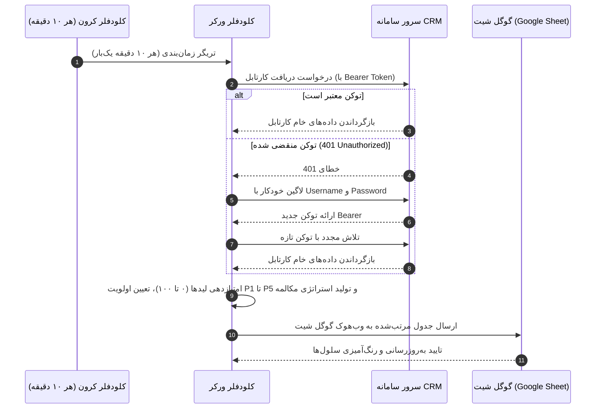

# 🚀 سیستم هوشمند اولویت‌بندی تماس‌های کارتابل CRM و اتصال به گوگل شیت

این پروژه یک **کلودفلر ورکر (Cloudflare Worker)** است که به API کارتابل CRM (`https://panel.hooshacrm.ir/api/my/cartable`) با **Bearer Token** متصل می‌شود، تمام لیدها و تماس‌های معوق را با الگوریتم‌های فروش و اولویت‌بندی تجاری آنالیز و رتبه‌بندی می‌کند، و آنها را در یک **گوگل شیت (Google Sheets)** منظم، رنگی و همراه با توصیه مکالمه درج می‌نماید.

این سیستم به طور خودکار **هر ۱۰ دقیقه یک‌بار** داده‌ها را به‌روزرسانی می‌کند و در صورتی که توکن منقضی شود، به صورت خودکار با نام‌کاربری و رمز عبور وارد پنل `https://panel.hooshacrm.ir/` شده و توکن جدید دریافت می‌کند.

همچنین دارای یک **داشبورد تحت وب فوق‌العاده مدرن فارسی (RTL)** با کارت‌های شاخص‌های کلیدی (KPI)، فیلترهای آنی P1 تا P5، جستجوی زنده، ساعت زنده ایران، امکان شماره‌گیری ۱-کلیکه (`tel:`)، کپی سریع شماره و دانلود مستقیم فایل **اکسل (CSV استاندارد UTF-8 BOM)** است.

---

## 📋 فهرست مطالب
1. [داده‌ها چگونه دریافت و به‌روزرسانی می‌شوند؟ (Data Flow)](#-دادهها-چگونه-دریافت-و-بهروزرسانی-میشوند)
2. [مکانیزم لاگین مجدد خودکار در صورت انقضای توکن (Auto Re-Login)](#-مکانیزم-لاگین-مجدد-خودکار-در-صورت-انقضای-توکن)
3. [منطق و فرمول اولویت‌بندی تماس‌ها (P1 تا P5)](#-منطق-و-فرمول-اولویتبندی-تماسها)
4. [ستون‌های ایجاد شده در گوگل شیت](#-ستونهای-ایجاد-شده-در-گوگل-شیت)
5. [راهنمای گام‌به‌گام راه‌اندازی و استفاده](#-راهنمای-گامبهگام-راهاندازی-و-استفاده)
   - [گام ۱: راه‌اندازی گوگل شیت و وب‌هوک](#گام-۱-راهاندازی-گوگل-شیت-و-وبهوک)
   - [گام ۲: تنظیم کلودفلر ورکر و متغیرها](#گام-۲-تنظیم-کلودفلر-ورکر-و-متغیرها)
   - [گام ۳: تست محلی و استقرار (Deploy)](#گام-۳-تست-محلی-و-استقرار-deploy)
6. [امکانات داشبورد مدرن (UI / UX)](#-امکانات-داشبورد-مدرن-ui--ux)
7. [اندپوینت‌ها و مسیرهای ورکر](#-اندپوینتها-و-مسیرهای-ورکر)

---

## 🔄 داده‌ها چگونه دریافت و به‌روزرسانی می‌شوند؟

سیستم به دو شیوه **کاملاً خودکار (هر ۱۰ دقیقه)** و **دستی (با ۱ کلیک)** کار می‌کند:



### روش‌های به‌روزرسانی:
1. **به‌روزرسانی خودکار پس‌زمینه (Cron Trigger)**:
   - در فایل `wrangler.jsonc` زمان‌بندی روی `"*/10 * * * *"` تنظیم شده است.
   - ورکر هر **۱۰ دقیقه یک‌بار** بدون نیاز به باز بودن مرورگر، دیتای کارتابل را دریافت کرده و شیت را با آخرین وضعیت به‌روز می‌کند.
2. **به‌روزرسانی دستی و فوری (On-Demand)**:
   - با کلیک روی دکمه **«🔄 همگام‌سازی فوری با گوگل شیت»** در داشبورد تحت وب ورکر.
   - یا با باز کردن آدرس `https://your-worker.workers.dev/sync` در مرورگر یا فراخوانی با cURL/Postman.

---

## 🔐 مکانیزم لاگین مجدد خودکار در صورت انقضای توکن

اگر توکن Bearer بعد از مدتی منقضی شود (دریافت کد `401 Unauthorized` یا `403 Forbidden`):
1. ماژول [`src/auth.js`](file:///m:/Coding/Github/crm-alien/src/auth.js) به صورت خودکار توکن منقضی‌شده را باطل می‌کند.
2. یک درخواست `POST` به اندپوینت ورود (`https://panel.hooshacrm.ir/api/auth/login`) با نام‌کاربری (`CRM_USERNAME` یا شماره موبایل) و رمز عبور (`CRM_PASSWORD`) ارسال می‌کند.
3. توکن تازه دریافتی را در حافظه ورکر ذخیره کرده و بلافاصله درخواست کارتابل را مجدداً تکرار می‌کند.
4. عملیات همگام‌سازی بدون کوچک‌ترین قطعی ادامه می‌یابد!

---

## 🎯 منطق و فرمول اولویت‌بندی تماس‌ها

هر لید بر اساس میزان احتمال خرید، فوریت زمانی و ارزش ریالی امتیازی بین **۰ تا ۱۰۰** دریافت کرده و در ۵ سطح اولویت دسته‌بندی می‌شود:

| سطح اولویت | امتیاز | معیارهای لید | استراتژی و اقدام پیشنهادی کارشناس |
|---|:---:|---|---|
| **P1 - فوری و حیاتی** | ۸۵ تا ۱۰۰ | • وضعیت `TIME_SET` (زمان تعیین‌شده توسط مخاطب)<br>• وضعیت `PROMISE_TO_PAY` (قول پرداخت داده)<br>• اقساط معوقه `balanceLeads` با مانده حساب | تماس دقیق در ساعت تعیین‌شده؛ ارسال سریع مشخصات واریز و درگاه؛ پیگیری تسویه اقساط |
| **P2 - اولویت بالا** | ۷۰ تا ۸۴ | • ثبت‌نام مجدد (`reRegConflict` / `isReRegistered`)<br>• وضعیت `NEGOTIATING` با تمایل بالا (`HIGH`) یا مبالغ بالای ۹ میلیون تومان | یادآوری ابراز تمایل دوباره لید؛ ارائه آفر ویژه و رفع موانع ثبت‌نام |
| **P3 - اولویت متوسط** | ۵۵ تا ۶۹ | • لیدهای جدید بدون تماس (`notCalled` / `status == NEW`)<br>• لیدهای نیازمند مشاوره (`NEEDS_CONSULT`) | برقراری تماس سریع اولیه (Speed-to-lead) برای کشف نیاز مخاطب، تبریک عضویت و معرفی دوره‌ها |
| **P4 - پیگیری معمول** | ۳۸ تا ۵۴ | • دانشجویان دوره رایگان (`freeCourse`)<br>• وضعیت `NO_ANSWER` با ۱ یا ۲ بار تلاش | پیگیری میزان پیشرفت در دوره رایگان؛ تماس در ساعات متفاوت روز برای عدم پاسخ‌ها |
| **P5 - اولویت پایین** | کمتر از ۳۸ | • وضعیت `NO_ANSWER` با ۳ بار یا بیشتر عدم پاسخ<br>• موارد مسدود یا رد شده (`isBanned` یا `REJECTED`) | به جای سوزاندن زمان تماس تلفنی کارشناس، ارسال پیامک خودکار، پیام در بات بله یا تلگرام |

---

## 📊 ستون‌های ایجاد شده در گوگل شیت

پس از همگام‌سازی، گوگل شیت شما شامل اطلاعات ساختاریافته زیر خواهد بود:

1. **ردیف**: شماره ردیف مرتب‌شده بر اساس اولویت
2. **سطح اولویت**: نشان P1 تا P5 به همراه رنگ اختصاصی (قرمز، نارنجی، آبی، سبز، خاکستری)
3. **امتیاز**: نمره اولویت از ۰ تا ۱۰۰
4. **نام و نام خانوادگی**: نام کامل ثبت‌شده لید
5. **شماره تماس**: شماره تلفن با فرمت استاندارد
6. **وضعیت فعلی**: کد وضعیت CRM (مثلاً `PROMISE_TO_PAY`, `TIME_SET`, `NEW`)
7. **دسته‌بندی کارتابل**: پوشه مبدأ در کارتابل
8. **موعد تماس بعدی**: تاریخ و ساعت به وقت ایران
9. **یادداشت و جزئیات**: آخرین توضیحات کارشناس یا علت تداخل/ثبت‌نام مجدد
10. **مبلغ پیشنهادی**: ارزش ریالی دوره یا پکیج به تومان
11. **مانده حساب**: مبالغ قسط یا تسویه نشده
12. **پرسونا و تگ مخاطب**: دسته‌بندی شغلی (صاحب کسب‌وکار، فریلنسر، خانگی و...)
13. **منبع لید**: نام کمپین، بلاگر، بات بله، یا پیامک
14. **استخر**: استخر تخصیص (وبسایت، بلاگری، تلگرام و...)
15. **تعداد عدم پاسخ**: تعداد دفعات عدم پاسخگویی لید
16. **استراتژی و توصیه تماس**: متن راهنمای مکالمه اختصاصی برای کارشناس
17. **آخرین تماس**: تاریخ و ساعت آخرین تماس برقرار شده
18. **کارشناس**: نام مسئول فعلی لید در CRM
19. **شناسه CRM**: آی‌دی یکتای لید در سیستم

---

## 🎨 امکانات داشبورد مدرن (UI / UX)

داشبورد وب ورکر با استانداردهای مدرن روز طراحی شده و شامل امکانات زیر است:
- **ساعت زنده ایران**: نمایش ثانیه‌شمار زمان رسمی ایران جهت تطبیق تماس‌های موعددار.
- **کارت‌های تعاملی KPI**: با کلیک روی هر کارت (P1، P2، P3 و...) جدول بلافاصله فیلتر می‌شود.
- **شماره‌گیری ۱-کلیکه (`tel:`)**: تماس تلفنی مستقیم با یک کلیک از طریق گوشی یا نرم‌افزارهای دسکتاپ.
- **کپی سریع شماره**: دکمه کپی فوری شماره تماس مخاطب همراه با انیمیشن تایید.
- **پرونده کامل لید (Modal)**: مشاهده تمام جزئیات لید با کلیک روی آیکون 👁️.
- **فیلترهای ترکیبی و جستجوی لحظه‌ای**: سرچ زنده در نام، شماره، یادداشت و متن استراتژی.

---

## 🛠 راهنمای گام‌به‌گام راه‌اندازی و استفاده

### گام ۱: راه‌اندازی گوگل شیت و وب‌هوک
۱. در Google Drive یک **Google Sheets** جدید بسازید.
۲. از منوی بالا روی **Extensions (افزونه‌ها) > Apps Script** کلیک کنید.
۳. تمام کدهای پیش‌فرض را پاک کرده و محتوای فایل [`src/google-apps-script.js`](file:///m:/Coding/Github/crm-alien/src/google-apps-script.js) را کپی و در آنجا ذخیره کنید.
۴. روی دکمه آبی **Deploy > New deployment** کلیک کنید:
   - نوع را **Web app** انتخاب کنید.
   - **Execute as** روی **Me**.
   - **Who has access** حتماً روی **Anyone**.
۵. دکمه **Deploy** را بزنید و آدرس وب‌هوک ایجاد شده (`https://script.google.com/macros/s/.../exec`) را کپی کنید.

---

### گام ۲: تنظیم کلودفلر ورکر و متغیرها
در ترمینال پروژه دستورات زیر را برای ثبت اطلاعات امنیتی وارد کنید:

```bash
# وارد کردن وب‌هوک گوگل شیت
npx wrangler secret put GOOGLE_SHEET_WEBHOOK_URL

# توکن Bearer مستقیم
npx wrangler secret put CRM_BEARER_TOKEN

# لاگین خودکار (برای تمدید اتوماتیک توکن در صورت انقضا)
npx wrangler secret put CRM_USERNAME
npx wrangler secret put CRM_PASSWORD
```

*(توجه: متغیرهای قبلی `HOOSHA_BEARER_TOKEN`، `HOOSHA_USERNAME` و `HOOSHA_PASSWORD` نیز جهت سازگاری به طور کامل پشتیبانی می‌شوند).*

---

### گام ۳: تست محلی و استقرار (Deploy)

۱. **اجرای تست آفلاین**:
```bash
npm run test:local
```

۲. **اجرای سرور تستی روی سیستم**:
```bash
npx wrangler dev
```
مرورگر را باز کرده و آدرس `http://localhost:8787` را مشاهده نمایید.

۳. **انتشار نهایی روی کلودفلر (Deploy)**:
```bash
npx wrangler deploy
```

---

## 🌐 اندپوینت‌ها و مسیرهای ورکر

| مسیر | متد | توضیحات |
|---|:---:|---|
| `/` یا `/dashboard` | `GET` | **داشبورد تعاملی فروش**؛ دارای کارت‌های آماری، فیلترهای P1 تا P5، سرچ لیدها، دکمه‌های شماره‌گیری سریع و دکمه سینک با گوگل شیت. |
| `/sync` | `POST` / `GET` | دریافت آنی اطلاعات از کارتابل CRM، اولویت‌بندی تماس‌ها و **ارسال مستقیم به گوگل شیت**. |
| `/export/csv` | `GET` | دانلود مستقیم فایل اکسل (CSV فرمت شده با UTF-8 BOM). |
| `/api/calls` | `GET` | خروجی خام ساختاریافته به صورت JSON استاندارد. |
